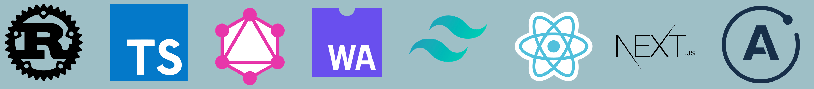

# "Les évadés du chenil" Web app 


## How to use

This app is based on `Next.js` And also `React` with WASM and rust for it
## This app use Apollo to deal with the backends

the backend is the project at [server github](https://github.com/les-evades-du-chenil/chenil-server)
### Rust and WASM
This project uses Rust compiled to wasm, the wasm file is included in the example, but to compile your own Rust code you'll have to [install](https://www.rust-lang.org/learn/get-started) Rust.

To compile `rust` file to `wasm` run:

```bash
npm run build-rust
# or
yarn build-rust
```

## CodeGen and GraphQL Type generation

the script `npm run codegen` will build type in */src/generated* based on codegen.yml

the other scripts are **next** basic :
- build
- start
- dev

## Stack
